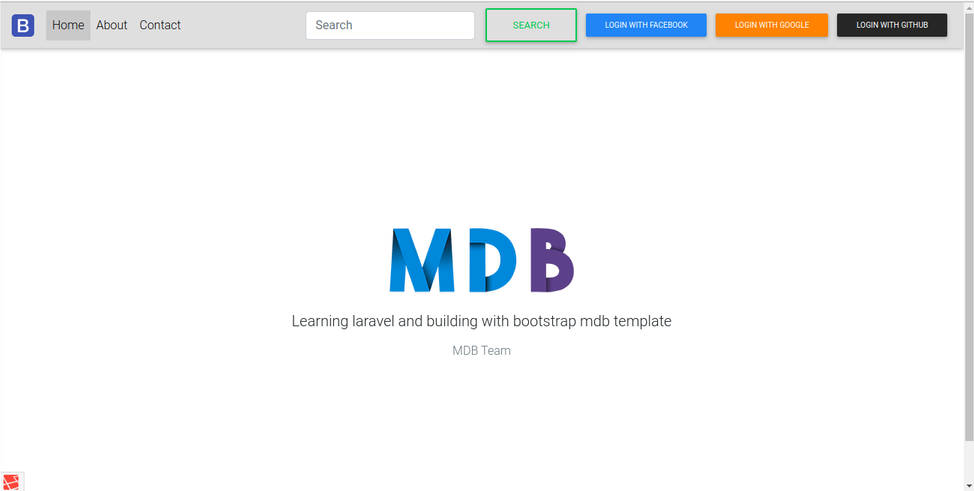

This project was bootstrapped using Laravel 5.6 and materialize-bootstrap

## Business Website for clients

This app is currently in progress, tips and suggestion is warmly appreciated:

### `Installation`

- $ git clone the repo
- $ cd into repo
- $ composer install
- $ Copy .env.example file to .env on the root folder. 
- $ Open your .env file and change the database name, username and password
- $ php artisan key:generate
- $ php artisan migrate
- $ php artisan serve

Then navigate to http://localhost:8000 to view the demo.

## Demo :sparkling_heart: :sparkling_heart: :sparkling_heart:

